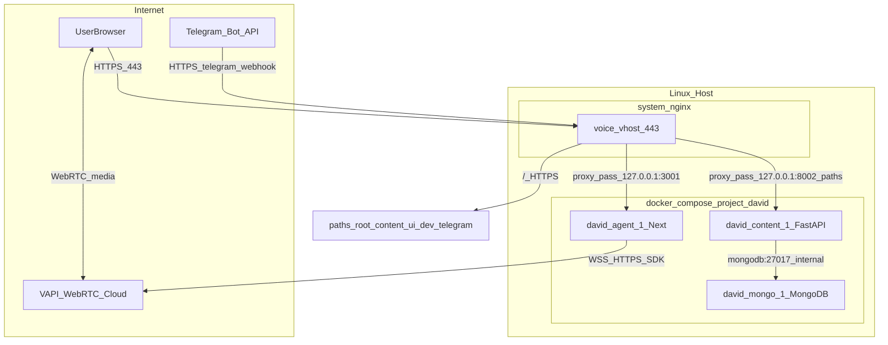

# Runtime architecture diagram

Назначение: визуализация **фактической** архитектуры на момент аудита (2026-05-07). См. текстовый SoT: [`RUNTIME_SOURCE_OF_TRUTH.md`](/home/david/projects/RUNTIME_SOURCE_OF_TRUTH.md).

---

## 1. Диаграмма (Mermaid)

**Пояснения к путям (логические):**

- **`/`** → `127.0.0.1:3001` → Next **agent**.
- **`/content/`**, **`/ui/`**, **`/dev/`** → `127.0.0.1:8002` → **content** (разные префиксы на FastAPI/Gradio).
- **`/telegram/...`** → `127.0.0.1:8002/telegram/...` → webhook и связанные HTTP endpoints **content**.

---

## 2. Что **не** показано на диаграмме

- **Контейнер `nginx` из `docker-compose.projects.yml`** — на снимке **не был** запущен; ingress = **system nginx**.
- **Локальные dev-туннели** (cloudflared/ngrok) — опциональный параллельный поток для разработки на хосте, не обязателен для production snapshot.
- **Будущий `agent-next`** — отсутствует; план: [`AGENT_NEXT_ISOLATION_PLAN.md`](/home/david/projects/AGENT_NEXT_ISOLATION_PLAN.md).

---

## 3. WebSocket / streaming (концептуально)

- **VAPI:** медиа и сигналинг преимущественно между **браузером** и **VAPI cloud**, не через self-hosted WebSocket сервер на порту приложения.
- **Custom WebSocket** к `content` (если появится) — отдельный endpoint на FastAPI; в текущей диаграмме не инвентаризировался; добавить после явного audit API.

---

*Конец документа.*
