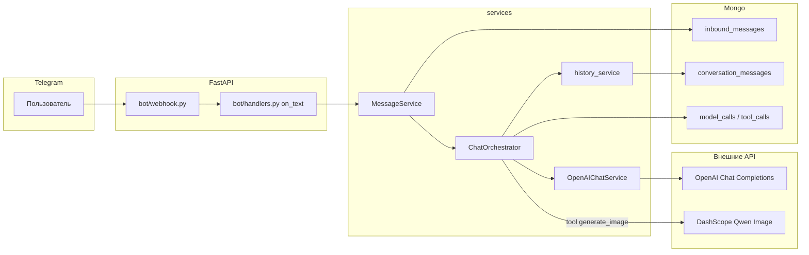

# Руководство по проекту для LLM и разработчиков

Документ описывает **Dream Viz** (репозиторий **Content**): назначение, архитектуру, основные потоки данных, модули и ограничения. Его можно передавать модели как контекст при правках кода, отладке и рефакторинге.

**Где описано хранение данных:** раздел **8** — MongoDB (поля документов по коллекциям, усечения, `trace_id`) и файлы под `data/`.

**Карта связей модулей:** раздел **5** — слои, диаграммы и как `application.py` связывает репозитории с сервисами.

---

## 1. Назначение проекта

Монолитное **Python-приложение** на **FastAPI**:

- Приём обновлений **Telegram** через **HTTPS webhook** (не long polling).
- Сохранение входящих данных в **MongoDB**.
- **Чат-агент** на базе **OpenAI Chat Completions** с tool calling (генерация изображений через Alibaba **DashScope / Qwen Image**).
- Просмотр входящих сообщений через **Gradio** (`/ui`).
- Локальная **dev-консоль** (`/dev/`, только `127.0.0.1`) для отладки сообщений, трейсов, ручной генерации картинок и **image-to-video (Wan)**.

Публичного «продакшен»-фронтенда кроме Gradio и dev UI нет.

---

## 2. Технологический стек

| Слой | Технологии |
|------|------------|
| HTTP-сервер | `uvicorn`, `FastAPI` |
| Telegram | `aiogram` 3.x, webhook route в `bot/webhook.py` |
| База данных | `motor` (async) + `pymongo` (sync для Gradio/dev) |
| LLM | `openai` SDK → Chat Completions, tools |
| Картинки (API) | `httpx` → DashScope multimodal-generation |
| Видео (API) | `httpx` → DashScope video-synthesis (async task + polling) |
| UI (админ/просмотр) | Gradio |
| Dev UI | Jinja2 + HTMX (без SPA-фреймворков) |
| Конфиг | `pydantic-settings`, файлы `ENV` / `env` / `.env` в корне |

---

## 3. Точки входа и запуск

| Файл | Роль |
|------|------|
| `main.py` | Запуск `uvicorn` с фабрикой `application:create_app` |
| `application.py` | `create_app()`: сборка FastAPI, lifespan, Mongo, бот, Gradio, dev router |
| `run_cloudflared_tunnel.py` | Отдельный процесс Cloudflare quick tunnel → пишет URL в `data/runtime/current_tunnel.txt` |

Типичный локальный запуск: `python main.py` (порт из `PORT`, по умолчанию `8000`).

Проверка: `GET /health` → `{"status":"ok"}`.

---

## 4. Конфигурация (`core/config/settings.py`)

Настройки читаются из **переменных окружения** и файлов **`ENV`**, **`env`**, **`.env`** в корне проекта (через `python-dotenv` с приоритетом файлов проекта).

**Обязательно для работы бота:**

- `TELEGRAM_BOT_TOKEN` — токен BotFather.

**Чат-агент:**

- `OPENAI_API_KEY` — без него бот отвечает заглушкой про отсутствие ключа (история в Mongo всё равно может писаться).
- `OPENAI_MODEL` — модель чата (по умолчанию `gpt-4o-mini`).

**MongoDB:**

- `MONGODB_URI`, `MONGODB_DB`
- Имена коллекций переопределяются полями `mongodb_collection_*` (см. ниже).

**DashScope (Qwen Image + Wan video):**

- `DASHSCOPE_API_KEY`
- Опционально: `DASHSCOPE_ENDPOINT` (мультимодальная генерация картинок), `DASHSCOPE_VIDEO_ENDPOINT` (video-synthesis URL).

**Dev-консоль:**

- `DEV_DEBUG_UI=true` (или алиас `DEBUG_CONSOLE`) — включает маршруты `/dev/*` (доступ **только с localhost**).

**Webhook / туннели:**

- `WEBHOOK_PATH` (по умолчанию `/webhook`)
- `TELEGRAM_WEBHOOK_URL` или `PUBLIC_BASE_URL` + путь
- `SET_WEBHOOK_ON_STARTUP`, `START_NGROK_TUNNEL`, `START_CLOUDFLARE_TUNNEL`, `EMBED_CLOUDFLARE_TUNNEL`, `CLOUDFLARED_BIN`, и т.д. — см. `README.md` и `settings.py`.

Полный список полей — в классе `Settings` в `core/config/settings.py`.

---

## 5. Архитектура приложения

Проект — **монолит** с **явной сборкой зависимостей** в `application.create_app()`: отдельного IoC-контейнера нет, граф объектов читается по цепочке конструкторов из одного файла.

### 5.1 Слои (логическая модель)

| Слой | Роль | Типичные модули |
|------|------|-----------------|
| **Вход** | HTTP-маршруты, webhook Telegram, опционально Gradio и `/dev` | `main.py`, `application.py`, `bot/webhook.py`, `ui/` |
| **Транспорт Telegram** | Маршрутизация апдейтов, внедрение `MessageService` | `bot/handlers.py`, `bot/asset_handlers.py`, `bot/middlewares.py` |
| **Прикладные сервисы** | Оркестрация сценариев, без знания HTTP | `services/message_service.py`, `services/chat/chat_orchestrator.py`, `services/assets/dream_asset_service.py`, `services/video/video_job_service.py` |
| **Интеграции LLM / медиа** | Тонкие клиенты к внешним API | `services/llm/openai_chat_service.py`, `services/images/qwen_image_client.py`, `services/video/wan_i2v_client.py` |
| **Чистые tools** | Синхронные вызовы генерации без Telegram/Mongo | `services/tools/image_tools.py`, `services/tools/video_tools.py` |
| **Хранилище** | Доступ к Mongo (async + sync пары) | `storage/*_repository.py`, `storage/mongo.py` |
| **Инфраструктура** | Конфиг, трейсы, туннели | `core/config/settings.py`, `core/observability/`, `core/tunnels/` |

**Правило разделения:** `services/tools/*` не импортирует aiogram и не пишет в Mongo; оркестратор (`ChatOrchestrator`) связывает tools, репозитории и Telegram.

### 5.2 Основной поток: текстовое сообщение в чате

Ниже — кто кого вызывает при обычном диалоге (без загрузки фото как ассета).



- **MessageService** — единая точка после хендлера: observability (если включён), запись в `inbound_messages`, затем делегирование в **ChatOrchestrator**.
- **ChatOrchestrator** — владелец сценария: история → OpenAI → при необходимости `tool_generate_image` (через `services/tools/image_tools.py` → `qwen_image_client`) → повторный вызов модели → ответ в Telegram; параллельно логи в `model_calls` / `tool_calls`. Опционально использует **DreamAssetRepository**, **UserProfileRepository**, **GeneratedImageRepository** (базовый персонаж, скрытый журнал кадров — см. код оркестратора).

### 5.3 Поток: визуальные ассеты (лицо / фото в чат)

Отдельный роутер **не** проходит через `MessageService` для полного диалога: `bot/asset_handlers.py` подключается к тому же `Dispatcher`, вызывает **DreamAssetService** → **DreamAssetRepository** → коллекция **`dream_assets`**. Классификация типа ассета задаёт состояние документа (`pending_classification` → `classified`).

**Связь с видео:** dev UI и `asset_source_service` могут скачать файл по `telegram_file_id` и подготовить вход для **Wan** (`video_jobs`).

### 5.4 Поток: видео (Wan i2v)

Инициация из **dev UI** или через **tool** (`services/tools/video_tools.py`) → **VideoJobService** → **WanI2VClient** (HTTP) + фоновый polling в отдельном потоке → обновления в **`video_jobs`**. Чат-бот в типовом сценарии может не участвовать.

### 5.5 Поток: dev-консоль `/dev/`

Прямые зависимости от **MessageRepository**, **ChatStoreRepository**, **ObservabilityRepository**, **DreamAssetRepository**, **VideoJobRepository** (см. `ui/dev/router.py`). Генерация картинок вызывает `tool_generate_image` на сервере; ключи не уходят в браузер.

### 5.6 Два клиента MongoDB

- **Motor (async)** — webhook, оркестратор, большинство вставок в рабочем пути.
- **PyMongo (sync)** — часть чтения для Gradio, sync-методы репозиториев (например списки для dev), фоновые sync-операции.

Оба указывают на одну БД (`MONGODB_DB`); имена коллекций — из `Settings`.

### 5.7 Сборка и старт (`application.py`)

При старте `create_app()`:

1. `ensure_data_dirs` — каталоги под `data/` (логи, temp, outputs, runtime, dev_uploads и т.д.).
2. Создаются **Motor** и **PyMongo** клиенты, репозитории через `storage/mongo.py`:
   - **`MessageRepository`** — `inbound_messages`;
   - **`ChatStoreRepository`** — `conversation_messages`, `model_calls`, `tool_calls`;
   - **`DreamAssetRepository`** — `dream_assets`;
   - **`VideoJobRepository`** — `video_jobs`;
   - **`UserProfileRepository`** — `user_profiles` (базовый персонаж и флаги онбординга);
   - **`GeneratedImageRepository`** — `generated_images` (скрытый журнал сгенерированных кадров);
   - при `DEV_DEBUG_UI` — **ObservabilityRepository** + **ObservabilityService**.
3. **DreamAssetService** (обёртка над dream assets) для роутера ассетов.
4. **OpenAIChatService** → передаётся в **ChatOrchestrator** вместе с `chat_store`, при необходимости observability и репозиториями dream/user_profile/generated_image.
5. **MessageService** получает `MessageRepository`, observability и **ChatOrchestrator**.
6. **aiogram**: `Bot`, `Dispatcher`, middleware с `MessageService`, роутеры `bot/handlers.py` и `bot/asset_handlers.py`.
7. **FastAPI**: регистрация webhook Telegram, `GET /health`, монтирование **Gradio** на `settings.gradio_mount_path` (по умолчанию `/ui`).
8. Если включён dev UI — `ui/dev/router.py`, статика `/dev/static`.

**Lifespan:** создание индексов Mongo (`ensure_*_indexes` в `application.py` и модулях `storage/`), опционально Cloudflare tunnel в процессе, `setWebhook`, при остановке — закрытие сессии бота и клиентов Mongo.

---

## 6. Поток: Telegram → обработка

1. Telegram шлёт **POST** на `{PUBLIC_URL}{WEBHOOK_PATH}`.
2. Обработчик в `bot/webhook.py` прокидывает апдейт в aiogram; выставляется **trace_id** (контекст в `core/observability/context.py`).
3. Хендлеры в `bot/handlers.py` вызывают **`MessageService.handle_inbound_message`** (и связанную логику для фото/ассетов — см. handlers).
4. **MessageService** (`services/message_service.py`):
   - пишет события в **Observability** (если включено);
   - сохраняет текст в коллекцию **inbound_messages**;
   - вызывает **`ChatOrchestrator.handle_user_message`** для текстовых сообщений (только `F.text` в `bot/handlers.py`).

Загрузка фото и сценарии **dream assets** — отдельный роутер `bot/asset_handlers.py` (см. §10).

Цепочка агента не использует отдельный «pipeline.py» — оркестрация сосредоточена в `ChatOrchestrator` (см. §5.2).

---

## 7. Чат-агент (`services/chat/chat_orchestrator.py`)

Идея:

1. Сохранить сообщение пользователя в **`conversation_messages`** через `history_service`.
2. Собрать контекст для OpenAI (системный промпт из `prompts/system_prompt.md` через `system_prompt_loader`).
3. Опционально: если у пользователя нет ни классифицированного **face** в `dream_assets`, ни записи **базового персонажа** в `user_profiles`, сценарий онбординга (запрос описания → `tool_generate_base_character` из `image_tools.py` → запись в `dream_assets` / профиль) может выполняться **до** или **вместо** обычного вызова генерации — см. логику в коде оркестратора.
4. Вызвать **Chat Completions** с tool **`generate_image`** (см. `OpenAIChatService`); схема OpenAI содержит только этот tool.
5. При вызове tool — **`tool_generate_image`** (`services/tools/image_tools.py`) → HTTP к DashScope (`services/images/qwen_image_client.py`); при наличии базового персонажа к промпту может добавляться суффикс консистентности лица.
6. При необходимости — второй раунд модели после результата tool; ответ пользователю в Telegram (текст / фото).
7. Логирование в Mongo: **`model_calls`**, **`tool_calls`** (укороченные payload’ы), успешные картинки — опционально в **`generated_images`** (без показа пользователю), события в **observability**.

В Mongo **не хранится** полный system prompt (обрезка в `_sanitize_messages_for_storage`).

---

## 8. Хранение данных (подробно)

### 8.1 Общие принципы

- **СУБД:** MongoDB, одна база на приложение — имя из `MONGODB_DB` (по умолчанию `dream_viz`; в `env` часто переопределяют).
- **Идентификаторы:** у документов стандартный Mongo **`_id`** (`ObjectId`); в Python/API часто передаётся как **строка**.
- **Время:** поля `created_at` / `updated_at` обычно в **UTC** (`datetime` с timezone).
- **Связность:** один логический запрос пользователя в Telegram связывается полем **`trace_id`** (строка) — оно попадает во входящие сообщения, observability, историю чата, `model_calls` / `tool_calls`, чтобы dev UI мог собрать таймлайн.
- **Секреты:** API-ключи **не** хранятся в Mongo; в логах и excerpt’ах длинные поля **обрезаются** (см. ниже).

Имена коллекций задаются в `Settings` (`mongodb_collection_*`) и могут быть переименованы через env.

---

### 8.2 Файловая система (корень `data/`)

Создаётся при старте (`storage/filesystem.py` → `ensure_data_dirs`):

| Путь | Назначение |
|------|------------|
| `data/logs/` | зарезервировано под логи приложения (при необходимости) |
| `data/temp/` | временные файлы |
| `data/outputs/` | выходные артефакты пайплайна |
| `data/runtime/` | служебные файлы процесса, напр. `current_tunnel.txt` (URL Cloudflare quick tunnel) |
| `data/dev_uploads/video_inputs/` | изображения, загруженные вручную через dev UI вкладки **Video** (имя файла = `{uuid}.{ext}`) |

**Промпты и тексты не в Mongo:** системный промпт агента лежит в репозитории: **`prompts/system_prompt.md`** (читается при запросе, не как «версии» в БД).

Сгенерированные **картинки Qwen** и **видео Wan** в проекте **не складываются на диск** по умолчанию — в Mongo/ответе API хранятся **URL** (или data URI в оперативной памяти до вызова Wan); скачивание на постоянное хранилище — задача внешних сценариев.

---

### 8.3 Коллекция `inbound_messages` (входящие Telegram)

Запись создаётся в `MessageRepository.save_text_message` (`storage/repository.py`).

**Типичные поля документа:**

| Поле | Смысл |
|------|--------|
| `_id` | ObjectId |
| `created_at` | UTC |
| `telegram_user_id`, `telegram_chat_id`, `telegram_message_id` | идентификаторы Telegram |
| `username` | username пользователя или `null` |
| `text` | текст сообщения |
| `raw_update` | опционально: урезанный/нормализованный фрагмент update (для отладки; не обязан быть полным raw Telegram) |
| `trace_id` | опционально: связь с observability и чат-трейсом |

Модель для чтения в Gradio: `InboundMessageRecord` (`storage/models.py`).

---

### 8.4 Коллекция `observability_events`

Структура события описана в `core/observability/models.py` (`ObservabilityEventDoc`). Документы пишутся через `ObservabilityRepository.insert_event` (к **`created_at`** добавляется при вставке).

**Поля:**

| Поле | Смысл |
|------|--------|
| `trace_id` | обязательно — цепочка событий |
| `created_at` | время |
| `event_type` | например `telegram.update`, `message.persisted`, `model.call`, `tool.call`, `error`, … |
| `telegram_user_id`, `telegram_chat_id` | опционально |
| `payload` | **dict** — произвольная нагрузка (в сервисе стараются не класть сырые секреты; часть полей может санитизироваться) |

Индексы: по `trace_id`, пользователю, типу события (см. `ensure_observability_indexes`).

---

### 8.5 Коллекция `conversation_messages` (история чата агента)

Вставки через `ChatStoreRepository.insert_conversation_message` (`storage/chat_repository.py`), логика полей — в `services/chat/history_service.py`.

**Поля документа:**

| Поле | Смысл |
|------|--------|
| `internal_user_id` | строка, обычно `str(telegram_user_id)` |
| `telegram_user_id`, `chat_id` | числа из Telegram |
| `role` | `user` \| `assistant` \| `tool` |
| `text` | текст; для tool — сериализованный результат / контент |
| `message_type` | например `text`, `text_after_tool`, `tool_result` |
| `metadata` | dict: для assistant может содержать `tool_calls`, для tool — `tool_call_id` и т.д. |
| `trace_id` | связь с сессией |
| `created_at` | при вставке |

История читается порциями для сборки запроса к OpenAI (`build_model_messages` в `history_service.py`).

---

### 8.6 Коллекция `model_calls` (лог запросов к OpenAI)

Заполняется из `ChatOrchestrator._persist_model_call` (`services/chat/chat_orchestrator.py`).

**Поля:**

| Поле | Смысл |
|------|--------|
| `internal_user_id`, `telegram_user_id`, `chat_id`, `trace_id` | контекст |
| `model_name` | имя модели из настроек (`OPENAI_MODEL`) |
| `turn_index` | номер «хода» в сценарии (например 1 — первый ответ модели, 2 — после tool) |
| `request_messages` | список сообщений запроса **после санитизации** `_sanitize_messages_for_storage`: system и длинные content **обрезаются** (system ~320 символов, длинный текст ~12k символов — см. константы в оркестраторе) |
| `system_prompt_preview` | короткий превью-текст через `system_prompt_preview(300)`, не полный файл промпта |
| `raw_response_excerpt` | усечённый ответ API (до ~20k символов в JSON) |
| `created_at` | при вставке |

**Важно:** полного system prompt и полных тел ответов в Mongo **нет** — только excerpt’ы.

---

### 8.7 Коллекция `tool_calls` (вызовы tools агента)

Заполняется из `_persist_tool_call` в `chat_orchestrator.py`.

**Поля:**

| Поле | Смысл |
|------|--------|
| `internal_user_id`, `telegram_user_id`, `chat_id`, `trace_id` | контекст |
| `tool_name` | имя функции (например вызов генерации картинки) |
| `tool_args` | аргументы вызова (dict) |
| `tool_result` | результат (dict), при ошибке может содержать поле `error` |
| `success` | bool |
| `created_at` | при вставке |

Дублирующее краткое отражение может попадать в `observability_events` через `ObservabilityService.record_tool_call` (excerpt результата ограничен по длине).

---

### 8.8 Коллекция `dream_assets`

Создание и обновление — `DreamAssetService` + `DreamAssetRepository`.

**Поля (логика):**

| Поле | Смысл |
|------|--------|
| `owner_user_id` | владелец (Telegram user id) |
| `telegram_user_id`, `chat_id` | контекст сообщения |
| `telegram_file_id` | id файла в Telegram Bot API (не URL; скачивание через `getFile`) |
| `source_message_id` | id сообщения-источника |
| `asset_type` | после классификации: `face`, `environment`, `dream_object`, `character`, `other` (константы в `dream_asset_service.py`) |
| `status` | например `pending_classification`, `classified`; для сгенерированного базового персонажа — `generated` |
| `is_base_character` | опционально `true` для автоматически созданного «базового» персонажа |
| `source_image_url` | опционально: URL результата Qwen, если нет `telegram_file_id` (сгенерированный персонаж) |
| `character_uuid` | опционально: строковый UUID, связанный с генерацией персонажа |
| `created_at`, `updated_at` | временные метки |

Сами **байты изображений в Mongo не хранятся** — для загрузок из Telegram достаточно **`telegram_file_id`**; для сгенерированных ассетов — **URL** в `source_image_url`.

---

### 8.9 Коллекция `video_jobs` (Wan image-to-video)

Запись ведёт `VideoJobService` (`services/video/video_job_service.py`), репозиторий — `storage/video_job_repository.py`.

**Базовые поля документа:**

| Поле | Смысл |
|------|--------|
| `owner_user_id` | строка (user id или метка вроде `dev_upload`) |
| `prompt` | текст промпта видео |
| `image_url` | **не полный data URI:** для длинных строк сохраняется компактная форма (`<data URI, N chars>`) или усечённый URL — см. `compact_image_url_for_storage` |
| `model`, `duration`, `resolution` | параметры генерации |
| `provider_task_id` | id задачи у DashScope после успешного create |
| `status` | `created` → `running` → `succeeded` \| `failed` |
| `video_url` | URL результата (когда готово; у провайдера ограниченный срок жизни) |
| `error` | текст ошибки при сбое |
| `raw_create_response` | опционально: ответ API при создании задачи |
| `progress` | опционально: если провайдер отдаёт |
| `created_at`, `updated_at` | метки |

Дополнительно в документ **мержатся** поля из `job_extra` при вызове `tool_image_to_video` / `create_video_job(extra=...)`, например:

- `source_type` — `dream_asset` \| `dev_upload`
- `source_label`, `dream_asset_id`, `dream_owner_user_id`, `dev_upload_path`, `dev_ui` и т.п.

Фоновый **polling** статуса у провайдера выполняется в **отдельном потоке** (sync HTTP + обновление Mongo), не блокируя event loop FastAPI.

---

### 8.10 Коллекция `user_profiles`

Репозиторий: `storage/user_profile_repository.py`. Один документ на **Telegram `user_id`** (уникальный индекс).

| Поле | Смысл |
|------|--------|
| `user_id` | числовой id пользователя Telegram |
| `base_character_asset_id` | строка `ObjectId` документа в `dream_assets` — закреплённый «базовый» персонаж для консистентных генераций |
| `awaiting_character_description` | `true`, пока бот ждёт текстовое описание внешности после блокировки `generate_image` без face/base |

Запись и обновление — из **`ChatOrchestrator`** (онбординг персонажа).

---

### 8.11 Коллекция `generated_images`

Репозиторий: `storage/generated_image_repository.py`. **Не показывается** пользователю в UI; предназначена для накопления кадров под будущий video pipeline.

| Поле | Смысл |
|------|--------|
| `user_id` | Telegram user id |
| `image_url` | URL сгенерированного изображения (как правило от Qwen) |
| `prompt` | фактический промпт (в т.ч. с суффиксом консистентности лица, если применялся) |
| `related_character_id` | опционально: `base_character_asset_id`, если на момент генерации был базовый персонаж |
| `created_at` | UTC |

Вставки выполняются из **`ChatOrchestrator`** при успешной генерации картинки и при создании базового персонажа.

---

### 8.12 Индексы Mongo

При старте приложения создаются индексы для коллекций сообщений, чата, observability, dream_assets, user_profiles, generated_images, video_jobs (см. `ensure_*_indexes` в `application.py` и модулях `storage/`). Точный набор — в коде соответствующих `ensure_*` функций.

---

### 8.13 Сводная таблица коллекций

| Коллекция (имя по умолчанию) | Что хранит |
|------------------------------|------------|
| `inbound_messages` | Входящие из Telegram |
| `observability_events` | События трейса для отладки |
| `conversation_messages` | История диалога для агента |
| `model_calls` | Усечённые запросы/ответы OpenAI |
| `tool_calls` | Вызовы tools и результаты |
| `dream_assets` | Метаданные визуальных ассетов + `telegram_file_id` (и опционально URL для сгенерированных) |
| `user_profiles` | Профиль пользователя: `base_character_asset_id`, `awaiting_character_description` |
| `generated_images` | Скрытый журнал сгенерированных кадров (`user_id`, `image_url`, `prompt`, `related_character_id`, `created_at`) |
| `video_jobs` | Задачи Wan i2v и статусы |

---

## 9. Observability (`core/observability/`)

- **ObservabilityService** пишет структурированные события (сообщение, этап пайплайна, model/tool call, ошибки).
- Для dev UI сообщения читаются агрегаторами в `services/observability/dev_messages.py` и `chat_trace_service.py`.
- **Не логировать** секреты (ключи API) в открытом виде; в коде предусмотрены обрезки и sanitize.

---

## 10. Dream assets

- Репозиторий: `storage/dream_asset_repository.py`.
- Сервис: `services/assets/dream_asset_service.py`.
- Хендлеры бота: `bot/asset_handlers.py` (роутер подключается в `application.py`).
- Dev UI вкладка **Dream assets**: список пользователей и таблица/карточки ассетов.

Для **video** dev UI: `services/assets/asset_source_service.py` скачивает файл по **`telegram_file_id`** через Bot API и превращает в **data URI** для Wan (внешний URL до картинки не обязателен).

---

## 11. Генерация изображений (Qwen)

- Клиент: `services/images/qwen_image_client.py` — POST на DashScope **multimodal-generation**.
- Tools: `services/tools/image_tools.py` — `tool_generate_image`, `tool_edit_image`; **`tool_generate_base_character`** вызывается из оркестратора (не входит в схему tools OpenAI).
- Dev UI: вкладка **Generation** — форма POST `/dev/api/generate` вызывает `tool_generate_image` без передачи ключей в браузер.

---

## 12. Видео: Wan image-to-video

Слои (не дублировать логику в других местах без необходимости):

1. **`services/video/wan_i2v_client.py`** — низкоуровневый HTTP: создание задачи (`X-DashScope-Async: enable`), GET `/api/v1/tasks/{task_id}`, опционально sync/async polling.
2. **`services/video/video_job_service.py`** — запись в **`video_jobs`**, вызов клиента, **фоновый поток** с polling провайдера (интервал ~5 с), обновление статуса в Mongo.
3. **`services/tools/video_tools.py`** — `tool_image_to_video`, `get_video_job_service()`; в Mongo для data URI хранится **компактное** представление, не многомегабайтная строка.

**Важно:** идентификатор модели в API должен совпадать с Model Studio (например `wan2.7-i2v`, а не короткое `wan2.7`). Ошибка `Model not exist` означает неверное имя модели или регион/endpoint.

Для **`wan2.7-i2v`** тело запроса должно содержать **`input.media`** (массив с `type: first_frame` и `url` — публичный URL или data URI), а не только устаревшее для этой версии поле **`input.img_url`**. Иначе задача может уйти в `FAILED` с сообщением вроде `Field required: input.media`. Реализация: `_model_uses_wan27_media_input` / `_build_input_image_to_video` в `wan_i2v_client.py`.

Опционально для той же модели добавляется второй элемент **`type: last_frame`** с URL конечного кадра (интерполяция движения между ключевыми кадрами). Проброс из tool: аргумент **`last_frame_url`** → `create_video_task(..., last_frame_url=...)`.

Ручной скрипт: `scripts/test_wan_video.py` (флаг `--last-frame-url`). Сводка по роли Режиссёр/Сборщик и OpenRouter: **`docs/assembler_tools.md`**.

### OpenRouter (изображения для Сборщика)

Отдельный tool **`generate_image_openrouter`**: ключ **`OPENROUTER_API_KEY`** только из окружения, см. `core/config/settings.py` и `services/images/openrouter_image_client.py`. Тест: `scripts/test_openrouter_image.py`.

---

## 13. Локальная dev-консоль (`/dev/`)

Условия: `DEV_DEBUG_UI=true`, запрос только с **localhost** (см. `ui/dev/router.py`).

Вкладки (см. `ui/dev/templates/index.html`):

| Вкладка | Содержание |
|---------|------------|
| **Messages** | Таблица входящих, детали с таймлайном агента (HTMX polling) |
| **Generation** | Qwen Image, результат и история в localStorage (клиент) |
| **Dream assets** | Пользователи и ассеты Mongo |
| **Video** | Источник (dream asset или загрузка файла в `data/dev_uploads/video_inputs/`), параметры, создание job, polling статуса, история jobs |

Статика: `/dev/static/` (`dev.css`, `dev_ui.js`).

Роутер монтируется в `application.py`; для video нужны **`video_job_repo`**, **`dream_asset_repo`**, **`settings`** (в т.ч. `TELEGRAM_BOT_TOKEN` для скачивания файлов по file_id).

---

## 14. Gradio (`ui/gradio_app.py`)

Просмотр недавних сообщений из Mongo (sync-чтение). Путь монтирования: `GRADIO_MOUNT_PATH` (по умолчанию `/ui`). Баннер и автооткрытие браузера — `ui/banner.py`.

---

## 15. Данные на диске (`data/`)

Подробная схема каталогов и того, что **не** хранится на диске (медиа из API), дана в **разделе 8.2**. Кратко: не коммитить секреты и тяжёлые артефакты; при необходимости настройте `.gitignore` под локальные выгрузки.

---

## 16. Промпты

Системный промпт агента: **`prompts/system_prompt.md`** (загрузка через `services/llm/system_prompt_loader.py`).

---

## 17. Типичные ошибки и подсказки для LLM

1. **Сообщения Telegram не приходят** — нет публичного HTTPS webhook; нужен туннель (ngrok / cloudflared) и `setWebhook`.
2. **`OPENAI_API_KEY` не задан** — оркестратор не вызывает модель; пользователь видит заглушку.
3. **DashScope / Wan** — проверить `DASHSCOPE_API_KEY`, регион endpoint, **точное имя модели** и лимиты размера картинки (для data URI — разумный размер файла).
4. **OpenRouter / изображения Сборщика** — `OPENROUTER_API_KEY`, при необходимости `OPENROUTER_IMAGE_MODEL`.
5. **Dev UI 403** — запрос не с localhost; задумано специально.
6. **Два клиента Mongo** — async Motor для хендлеров, sync PyMongo для части UI и фоновых sync-путей; не смешивать контракты без явного запроса.
7. **Редактирование кода** — минимальные изменения по задаче; не удалять observability/dev без явного запроса.

---

## 18. Карта каталогов (кратко)

```
Content/
  main.py
  application.py
  bot/                 # webhook, handlers, middleware, dream asset router
  core/
    config/settings.py
    observability/
    tunnels/           # cloudflare tunnel helpers
  services/
    chat/              # orchestrator, history_service
    llm/               # OpenAI, system prompt
    images/            # qwen_image_client
    tools/             # image_tools, video_tools
    video/             # wan_i2v_client, video_job_service
    assets/            # dream_asset_service, asset_source_service
    message_service.py
    observability/     # dev_messages, chat_trace_service
  storage/             # mongo factories, repositories, models
  ui/
    dev/               # Jinja + HTMX dev console
    gradio_app.py
    banner.py
  prompts/system_prompt.md
  scripts/             # test_wan_video, test_qwen_image, …
  docs/LLM_PROJECT_GUIDE.md   # этот файл
```

---

## 19. Как использовать этот документ вместе с LLM

- При **новой фиче** уточнять: FastAPI route или фоновая задача, нужен ли Mongo, затрагивается ли Telegram или только dev.
- При **баге** — воспроизведение через `/health`, логи uvicorn, коллекция Mongo, `trace_id` из dev Messages.
- При **интеграции API** — сверять с существующими клиентами (`qwen_image_client`, `wan_i2v_client`), не дублировать ключи в шаблонах.

Документ можно обновлять по мере изменения архитектуры; дата актуальности — по коммитам, затрагивающим перечисленные модули.
